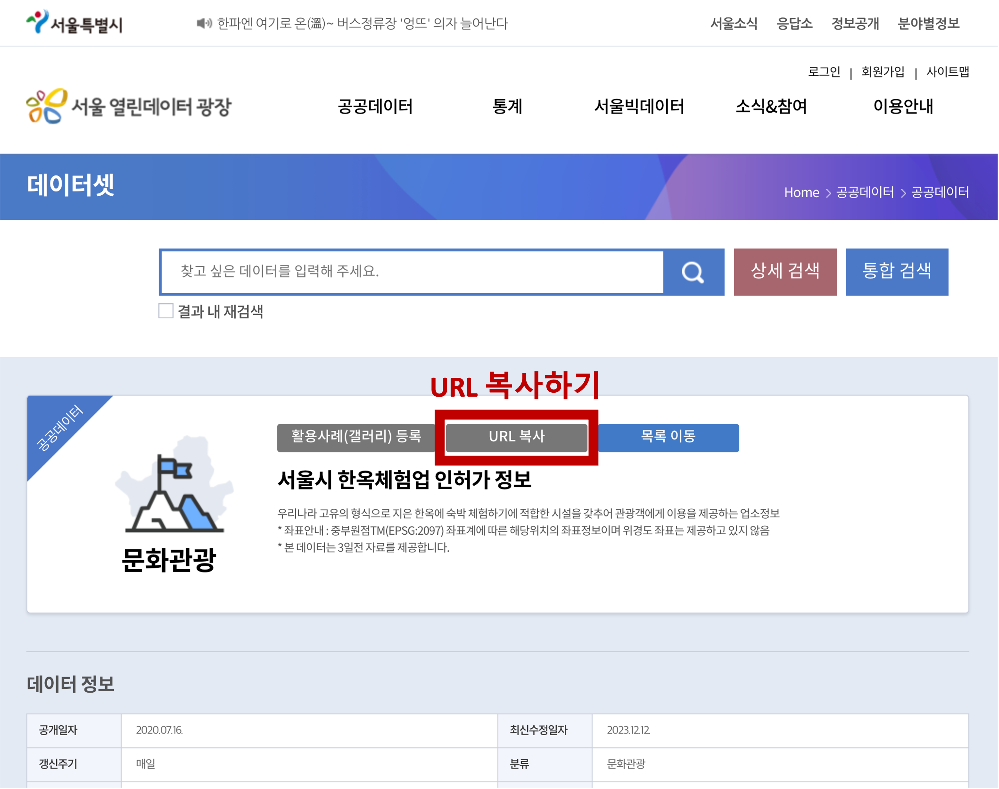

# GeoPin

서울시 공공데이터 API 지도 뷰어 서비스

서울시 공공데이터를 지도로 편리하게 확인해보세요!

**[서비스 사용해보기](https://geopin.shiwoo.dev)**

**[샘플 사용 예시](https://geopin.shiwoo.dev/?targetUrl=https%253A%252F%252Fdata.seoul.go.kr%252FdataList%252FOA-16133%252FS%252F1%252FdatasetView.do&serviceName=LOCALDATA_103201&serviceNameKorean=wRzGuMLcACCy-a1sx6XFxQAgx3jVyKwAACDIFbz0&fieldNameMapString=AHsAIgBPAFAATgBTAEYAVABFAEEATQBDAE8ARABFACIAOgAirBy8KceQzliy6My0z1S03AAiACwAIgBNAEcAVABOAE8AIgA6ACKtALmsvIjWOAAiACwAIgBBAFAAVgBQAEUAUgBNAFkATQBEACIAOgAix3jVyKwAx3zHkAAiACwAIgBBAFAAVgBDAEEATgBDAEUATABZAE0ARAAiADoAIsd41cisAM3owYzHfMeQACIALAAiAFQAUgBEAFMAVABBAFQARQBHAEIATgAiADoAIsYBxcXAwdDcz1S03AAiACwAIgBUAFIARABTAFQAQQBUAEUATgBNACIAOgAixgHFxcDB0Ny6hQAiACwAIgBEAFQATABTAFQAQQBUAEUARwBCAE4AIgA6ACLAwcE4xgHFxcDB0NzPVLTcACIALAAiAEQAVABMAFMAVABBAFQARQBOAE0AIgA6ACLAwcE4xgHFxcDB0Ny6hQAiACwAIgBEAEMAQgBZAE0ARAAiADoAItPQxcXHfMeQACIALAAiAEMATABHAFMAVABEAFQAIgA6ACLXNMXFwtzHkcd8x5AAIgAsACIAQwBMAEcARQBOAEQARABUACIAOgAi1zTFxciFuMzHfMeQACIALAAiAFIATwBQAE4AWQBNAEQAIgA6ACLHrKwcxcXHfMeQACIALAAiAFMASQBUAEUAVABFAEwAIgA6ACLIBNZUvIjWOAAiACwAIgBTAEkAVABFAEEAUgBFAEEAIgA6ACLBjMesycC6dMgBACIALAAiAFMASQBUAEUAUABPAFMAVABOAE8AIgA6ACLBjMesycDGsNO4vIjWOAAiACwAIgBTAEkAVABFAFcASABMAEEARABEAFIAIgA6ACLJwLyIyPzBjAAiACwAIgBSAEQATgBXAEgATABBAEQARABSACIAOgAis8S4XLqFyPzBjAAiACwAIgBSAEQATgBQAE8AUwBUAE4ATwAiADoAIrPEuFy6hcaw07i8iNY4ACIALAAiAEIAUABMAEMATgBNACIAOgAiwKzFxceluoUAIgAsACIATABBAFMAVABNAE8ARABUAFMAIgA6ACLNXMiFwhjIFcd8x5AAIgAsACIAVQBQAEQAQQBUAEUARwBCAE4AIgA6ACKzcMd00TCsMcLgrWy9hAAiACwAIgBVAFAARABBAFQARQBEAFQAIgA6ACKzcMd00TCsMcLgx3zHkAAiACwAIgBVAFAAVABBAEUATgBNACIAOgAixcXQ3K1svYS6hQAiACwAIgBYACIAOgAiyIzUXMgVvPQAKABYACkAIgAsACIAWQAiADoAIsiM1FzIFbz0ACgAWQApACIALAAiAEMAVQBMAFAASABZAEUARABDAE8AQgBOAE0AIgA6ACK7ONZUzLTHIcXFyIW6hQAiACwAIgBQAFUAUABSAFMARQBOAE0AIgA6ACKs9cCsub2tbL2EuoUAIgAsACIASQBOAFMAVQBSAEoATgBZAE4AQwBPAEQARQAiADoAIrz01disAMeFxey9gM9UtNwAIgAsACIATABEAEUAUgBDAE4AVAAiADoAIsnAs8THkMIYACIALAAiAEIARABOAEcARABOAEcATgBVAE0AIgA6ACKsdM2Vuzyz2cIYACIALAAiAEIARABOAEcAWQBBAFIARQBBACIAOgAirHTNlbs8xfC6dMgBACIALAAiAE0ARQBNAEMATwBMAEwAVABPAFQAUwBUAEYATgBVAE0AIgA6ACLWjMbQuqjJ0c0dx3jG0AAiACwAIgBEAFIATQBLAEMATwBCAE4ATQAiADoAIsE4vYDFxciFuoUAIgAsACIAQgBVAFAATgBNACIAOgAivJXHeLqFACIAfQ&epsg=EPSG%3A2097&fieldType=address&addressFieldName=RDNWHLADDR&dataKeyPick=APVPERMYMD&dataKeyPick=TRDSTATENM&dataKeyPick=DTLSTATENM&dataKeyPick=BPLCNM)**

## 서비스 소개

[서울시 공공데이터 포털](https://data.seoul.go.kr/)에서 조회하고자 하는 **Open API 데이터의 URL**을 입력해주세요!

### 좌표계, 한글 필드명 자동 변환

GeoPin은 **좌표계**와 **한글 필드명**을 자동으로 변환해줍니다. 간편하게 서울 공공 데이터의 공간정보를 조회해보세요!
